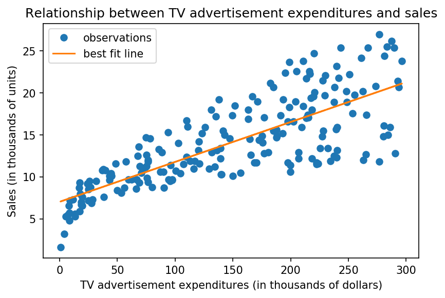

<h1 align="center">Module 4 Assessment</h1>

## Overview

This assessment is designed to test your understanding of the Mod 4 material. It covers:

* Calculus, Cost Function, and Gradient Descent
* Extensions to Linear Models
* Introduction to Linear Regression
* Time Series Modeling


Read the instructions carefully. You will be asked both to write code and respond to a few short answer questions.

### Note on the short answer questions

For the short answer questions please use your own words. The expectation is that you have not copied and pasted from an external source, even if you consult another source to help craft your response. While the short answer questions are not necessarily being assessed on grammatical correctness or sentence structure, do your best to communicate yourself clearly.

---
## Calculus, Cost Function, and Gradient Descent
---



The best fit line that goes through the scatterplot up above can be generalized in the following equation: $$y = mx + b$$

Of all the possible lines, we can prove why that particular line was chosen using the plot down below:


where RSS is defined as the residual sum of squares:

$$ 
\begin{align}
RSS &= \sum_{i=1}^n(actual - expected)^2 \\
&= \sum_{i=1}^n(y_i - \hat{y})^2 \\
&= \sum_{i=1}^n(y_i - (mx_i + b))^2
\end{align}
$$ 

### 1. What is a more generalized name for the RSS curve up above?

// your answer here //

### 2A. Would you rather choose a $m$ value of 0.08 or 0.03 from the curve up above? 

// your answer here //

### 2B. Explain what it means to move along the curve in relation to the best fit line with respect to the $m$ value you chose in 2A.

// your answer here //


### 3. Using the gradient descent visual from above, explain why the distance between steps is getting smaller.

// your answer here //

### 4. Explain how a very small and a very large learning rate would affect the gradient descent.

// your answer here //

---
## Extensions to Linear Regression
---


```python
import pandas as pd
import itertools
import seaborn as sns
import matplotlib.pyplot as plt
%matplotlib inline
import seaborn as sns
import numpy as np
from sklearn.linear_model import Lasso, Ridge
import pickle
from sklearn.metrics import mean_squared_error, roc_curve, roc_auc_score, accuracy_score
from sklearn.linear_model import LinearRegression, LogisticRegression
from sklearn.model_selection import train_test_split
from sklearn.preprocessing import PolynomialFeatures
from sklearn.preprocessing import StandardScaler
```


```python
data = pd.read_csv('raw_data/advertising.csv').drop('Unnamed: 0',axis=1)
data.describe()
```


```python
X = data.drop('sales', axis=1)
y = data['sales']
```


```python
# split the data into training and testing set
X_train , X_test, y_train, y_test = train_test_split(X, y,random_state=2019)
```

### 1. Write a Function to calculate train and test error for different polynomial degree (1-9)? 


```python
def cal_degree(poly_degree):
    '''calculate train and test error for different polynomial degree (1-9)'''
    train_errors = None
    test_errors = None
    
#       For each model with different polynomial degree:
#       Create object for PolynomialFeatures with necessary parameters
#       get the polynomialfeatures for training and testing
#       Fit the LinearRegression to new Features and y_train
#       Calculate the testing and training error (Root mean squared error)
#       Add train and test errors to numpy arrays
        
    return train_errors, test_errors
```


```python
error_train = cal_degree(10)[0].tolist()
error_test = cal_degree(10)[1].tolist()
```

#error_train = [1.6872219375656985, 0.6412867668294241, 0.4711637753473785, 0.36944896135164984, 
                0.2410561613114944, 0.2564919445411836, 0.3165437580993593,
                0.3903584583915307, 0.32526008157451436, 0.7955206228171482]
#error_test = [1.6340815294866986, 0.4951157689460942, 0.4798020916835737, 0.4870596445796682,
               0.4608682794261582, 1.198082221301244, 4.440474842230711, 
               19.919529327003232, 129.4605767258836, 1066.1109145234598]

### 2. How does increasing polynomial degree effect Bias and Variance? 


// your answer here //

### 3. What method would you use to mitigate the overfitting and underfitting? 

// your answer here //

### 4. What is the alpha in Lasso Regression? Find the optimal alpha value for Lasso Regression for the given polynomial features.

<!---
poly = PolynomialFeatures(degree=10, interaction_only=False, include_bias=False)
X_poly_train = poly.fit_transform(X_train) 
X_poly_test = poly.transform(X_test)
pickle.dump(X_poly_train, open("write_data/poly_train_model.pkl", "wb"))
pickle.dump(X_poly_test, open("write_data/poly_test_model.pkl", "wb"))
--->


```python
X_poly_train = pickle.load(open("write_data/poly_train_model.pkl", "rb"))
X_poly_test = pickle.load(open("write_data/poly_test_model.pkl", "rb"))
size = 100
alphas = np.linspace(0, 1, size)

error = np.zeros(size)
for i, alpha in enumerate(np.linspace(.1, 10, size)):
    # for each alpha value between .1 and 10
    # create a Lasso model
    lasso = Lasso(alpha=alpha, tol=0.06)
    # fit X_poly_train and y_train onto the Lasso model 
    lasso.fit(X_poly_train,y_train)
    # calculate the predictions from the Lasso model
    y_pred = lasso.predict(X_poly_test)
    # calculate the MSE from your predictions
    score = mean_squared_error(y_pred, y_test)
    # place the MSE inside of the error object
    error[i] = score

alphas[np.argmin(error)]
```

---
## Introduction to Logistic Regression
---

<!---
# load data
ads_df = pd.read_csv("raw_data/social_network_ads.csv")

# one hot encode categorical feature
def is_female(x):
    """Returns 1 if Female; else 0"""
    if x == "Female":
        return 1
    else:
        return 0
        
ads_df["Female"] = ads_df["Gender"].apply(is_female)
ads_df.drop(["User ID", "Gender"], axis=1, inplace=True)
ads_df.head()

# separate features and target
X = ads_df.drop("Purchased", axis=1)
y = ads_df["Purchased"]

# train/test split
X_train, X_test, y_train, y_test = train_test_split(X, y, random_state=19)

# preprocessing
scale = StandardScaler()
scale.fit(X_train)
X_train = scale.transform(X_train)
X_test = scale.transform(X_test)

# save preprocessed train/test split objects
pickle.dump(X_train, open("write_data/social_network_ads/X_train_scaled.pkl", "wb"))
pickle.dump(X_test, open("write_data/social_network_ads/X_test_scaled.pkl", "wb"))
pickle.dump(y_train, open("write_data/social_network_ads/y_train.pkl", "wb"))
pickle.dump(y_test, open("write_data/social_network_ads/y_test.pkl", "wb"))

# build model
model = LogisticRegression(C=1e5, solver="lbfgs")
model.fit(X_train, y_train)
y_test_pred = model.predict(X_test)
y_train_pred = model.predict(X_train)

from sklearn.metrics import confusion_matrix

# create confusion matrix
# tn, fp, fn, tp
cnf_matrix = confusion_matrix(y_test, y_test_pred)
cnf_matrix

# build confusion matrix plot
plt.imshow(cnf_matrix,  cmap=plt.cm.Blues) #Create the basic matrix.

# Add title and Axis Labels
plt.title('Confusion Matrix')
plt.ylabel('True label')
plt.xlabel('Predicted label')

# Add appropriate Axis Scales
class_names = set(y_test) #Get class labels to add to matrix
tick_marks = np.arange(len(class_names))
plt.xticks(tick_marks, class_names)
plt.yticks(tick_marks, class_names)

# Add Labels to Each Cell
thresh = cnf_matrix.max() / 2. #Used for text coloring below
#Here we iterate through the confusion matrix and append labels to our visualization.
for i, j in itertools.product(range(cnf_matrix.shape[0]), range(cnf_matrix.shape[1])):
        plt.text(j, i, cnf_matrix[i, j],
                 horizontalalignment="center",
                 color="white" if cnf_matrix[i, j] > thresh else "black")

# Add a Side Bar Legend Showing Colors
plt.colorbar()

# Add padding
plt.tight_layout()
plt.savefig("visuals/cnf_matrix.png",
            dpi=150,
            bbox_inches="tight")
--->


### 1. Using the confusion matrix up above, calculate precision, recall, and F-1 score.

// your answer here //

### 2. Explain how precision is different from recall and why you should consider using the F-1 score when you are evaulating your model.

// your answer here //

<!---
# save preprocessed train/test split objects
X_train = pickle.load(open("write_data/social_network_ads/X_train_scaled.pkl", "rb"))
X_test = pickle.load(open("write_data/social_network_ads/X_test_scaled.pkl", "rb"))
y_train = pickle.load(open("write_data/social_network_ads/y_train.pkl", "rb"))
y_test = pickle.load(open("write_data/social_network_ads/y_test.pkl", "rb"))

# build model
model = LogisticRegression(C=1e5, solver="lbfgs")
model.fit(X_train, y_train)
y_test_pred = model.predict(X_test)
y_train_pred = model.predict(X_train)

labels = ["Age", "Estimated Salary", "Female", "All Features"]
colors = sns.color_palette("Set2")
plt.figure(figsize=(10, 8))
# add one ROC curve per feature
for feature in range(3):
    # female feature is one hot encoded so it produces an ROC point rather than a curve
    # for this reason, female will not be included in the plot at all since it is
    # disingeneuous to call it a curve.
    if feature == 2:
        pass
    else:
        X_train_feat = X_train[:, feature].reshape(-1, 1)
        X_test_feat = X_test[:, feature].reshape(-1, 1)
        logreg = LogisticRegression(fit_intercept=False, C=1e12, solver='lbfgs')
        model_log = logreg.fit(X_train_feat, y_train)
        y_score = model_log.decision_function(X_test_feat)
        fpr, tpr, thresholds = roc_curve(y_test, y_score)
        lw = 2
        plt.plot(fpr, tpr, color=colors[feature],
                 lw=lw, label=labels[feature])

# add one ROC curve with all the features
model_log = logreg.fit(X_train, y_train)
y_score = model_log.decision_function(X_test)
fpr, tpr, thresholds = roc_curve(y_test, y_score)
lw = 2
plt.plot(fpr, tpr, color=colors[3], lw=lw, label=labels[3])

# create foundation of the plot
plt.plot([0, 1], [0, 1], color='navy', lw=lw, linestyle='--')
plt.xlim([0.0, 1.0])
plt.ylim([0.0, 1.05])
plt.yticks([i / 20.0 for i in range(21)])
plt.xticks([i / 20.0 for i in range(21)])
plt.xlabel("False positive rate")
plt.ylabel("True positive rate")
plt.title("ROC Curve")
plt.legend()
plt.tight_layout()
plt.savefig("visuals/many_roc.png",
            dpi=150,
            bbox_inches="tight")
--->

### 3. Pick the best ROC curve and explain your choice.

*Note: each ROC curve represents one model, each labeled with the feature(s) inside each model*.


// your answer here //

<!---
# sorting by 'Purchased' and then dropping the last 130 records
dropped_df = ads_df.sort_values(by="Purchased")[:-130]
dropped_df.reset_index(inplace=True)
pickle.dump(dropped_df, open("write_data/sample_network_data.pkl", "wb"))
--->


```python
network_df = pickle.load(open("write_data/sample_network_data.pkl", "rb"))

# partion features and target 
X = network_df.drop("Purchased", axis=1)
y = network_df["Purchased"]

# train test split
X_train, X_test, y_train, y_test = train_test_split(X, y, random_state=2019)

# scale features
scale = StandardScaler()
scale.fit(X_train)
X_train = scale.transform(X_train)
X_test = scale.transform(X_test)

# build classifier
model = LogisticRegression(C=1e5, solver="lbfgs")
model.fit(X_train,y_train)
y_test_pred = model.predict(X_test)

# get the accuracy score
print(f"The original classifier has an accuracy score of {round(accuracy_score(y_test, y_test_pred), 3)}.")

# get the area under the curve from an ROC curve
y_score = model.decision_function(X_test)
fpr, tpr, _ = roc_curve(y_test, y_score)
auc = round(roc_auc_score(y_test, y_score), 3)
print(f"The original classifier has an area under the ROC curve of {auc}.")
```

### 4. The model above has an accuracy score that it too good to believe. Using `y.value_counts()`, explain how `y` is affecting the accuracy score.


```python
# code here
```

// your answer here //

### 5. Update the inputs in the classification model using a technique to address the issues mentioned up above in question 4. 

Be sure to include updates regarding:
* the accuracy score; and
* the area under the curve (AUC)


```python
from imblearn.over_sampling import SMOTE
smote = SMOTE(random_state=2019)
X_train_resampled, y_train_resampled = smote.fit_sample(X_train, y_train) 
model_smote = LogisticRegression(C=1e5, solver="lbfgs")
model_smote.fit(X_train_resampled, y_train_resampled)
y_test_pred_smote = model_smote.predict(X_test)
y_train_pred_smote = model_smote.predict(X_train_resampled)

# assess accuracy
score_smote = round(accuracy_score(y_test, y_test_pred_smote), 3)
print(f"The updated classifier has an accuracy score of {score_smote}.")

y_score_smote = model_smote.decision_function(X_test)
fpr_smote, tpr_smote, _ = roc_curve(y_test, y_score_smote)
auc_smote = roc_auc_score(y_test, y_score_smote)
print(f"The updated classifier has an area under the ROC curve of {auc_smote}.")

lw = 2
plt.plot(fpr, tpr,
         lw=lw, label="Class imbalanced")
plt.plot(fpr_smote, tpr_smote,
         lw=lw, label="Class balanced after using SMOTE")
# create foundation of the plot
plt.plot([0, 1], [0, 1], color='navy', lw=lw, linestyle='--')
plt.xlim([0.0, 1.0])
plt.ylim([0.0, 1.05])
plt.yticks([i / 20.0 for i in range(21)])
plt.xticks([i / 20.0 for i in range(21)])
plt.xlabel("False positive rate")
plt.ylabel("True positive rate")
plt.title("ROC Curve")
plt.legend()
plt.tight_layout()
```


```python

```
